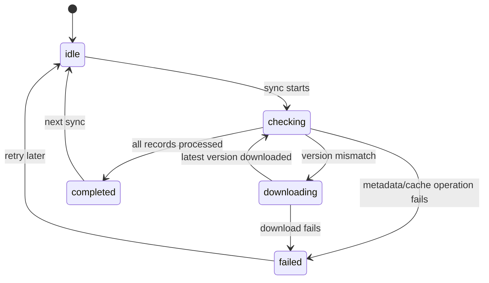
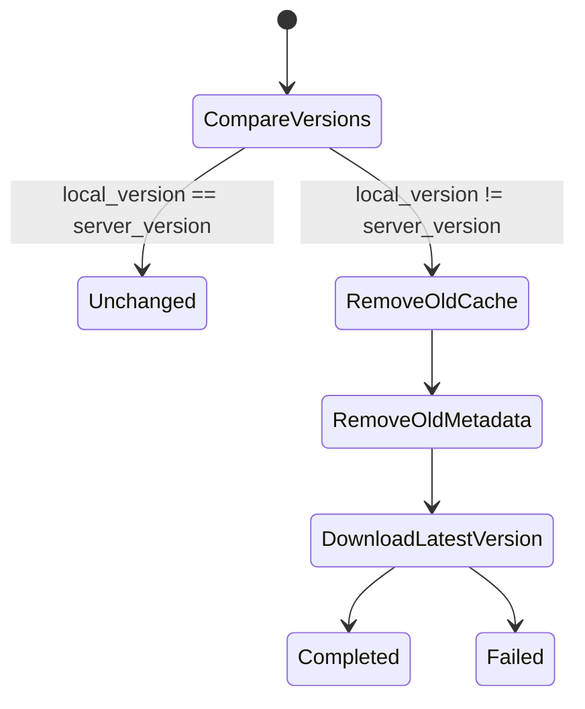
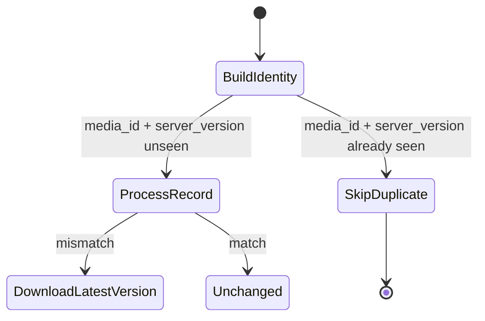

# Media Sync State Diagrams

## Sync Lifecycle

```mermaid
stateDiagram-v2
  [*] --> idle
  idle --> checking: sync starts
  checking --> downloading: version mismatch
  downloading --> checking: latest version downloaded
  checking --> completed: all records processed
  checking --> failed: metadata/cache operation fails
  downloading --> failed: download fails
  completed --> idle: next sync
  failed --> idle: retry later
```

## Version Mismatch

```mermaid
stateDiagram-v2
  [*] --> CompareVersions
  CompareVersions --> Unchanged: local_version == server_version
  CompareVersions --> RemoveOldCache: local_version != server_version
  RemoveOldCache --> RemoveOldMetadata
  RemoveOldMetadata --> DownloadLatestVersion
  DownloadLatestVersion --> Completed
  DownloadLatestVersion --> Failed
```

## Duplicate Prevention

```mermaid
stateDiagram-v2
  [*] --> BuildIdentity
  BuildIdentity --> ProcessRecord: media_id + server_version unseen
  BuildIdentity --> SkipDuplicate: media_id + server_version already seen
  ProcessRecord --> DownloadLatestVersion: mismatch
  ProcessRecord --> Unchanged: match
  SkipDuplicate --> [*]
```
