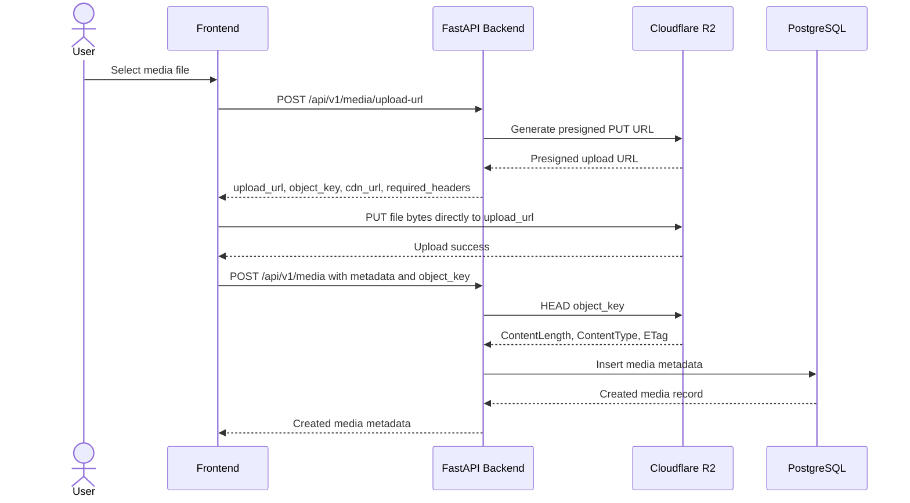

# Media Upload Workflow

The backend never proxies media bytes. Clients upload directly to Cloudflare R2 using a presigned URL. PostgreSQL stores metadata only after the backend verifies the uploaded R2 object exists and matches the expected metadata.

## Sequence Diagram



## API Contracts

### Request Upload URL

`POST /api/v1/media/upload-url`

Request:

```json
{
  "filename": "launch-screen.png",
  "content_type": "image/png",
  "file_size": 1024
}
```

Response:

```json
{
  "upload_url": "https://...",
  "object_key": "media/uuid-launch-screen.png",
  "cdn_url": "https://cdn.example.com/media/uuid-launch-screen.png",
  "expires_in": 900,
  "required_headers": {
    "Content-Type": "image/png"
  }
}
```

Validation:

- `filename` is required.
- `content_type` is required.
- `file_size` must be greater than zero.
- `file_size` must not exceed `R2_MAX_UPLOAD_SIZE_BYTES`.

Errors:

- `400`: invalid upload request.
- `503`: R2 configuration or presigned URL generation failure.

### Create Media Metadata

`POST /api/v1/media`

Request:

```json
{
  "title": "Launch Screen",
  "media_type": "image",
  "cdn_url": "https://cdn.example.com/media/uuid-launch-screen.png",
  "version": 1,
  "file_size": 1024,
  "object_key": "media/uuid-launch-screen.png",
  "content_type": "image/png"
}
```

Response:

```json
{
  "id": "00000000-0000-0000-0000-000000000001",
  "title": "Launch Screen",
  "media_type": "image",
  "cdn_url": "https://cdn.example.com/media/uuid-launch-screen.png",
  "version": 1,
  "file_size": 1024,
  "created_at": "2026-06-05T00:00:00Z",
  "updated_at": "2026-06-05T00:00:00Z"
}
```

Validation:

- The backend checks `object_key` exists in R2 using `HEAD`.
- R2 `ContentLength` must match `file_size`.
- R2 `ContentType` must match `content_type`.
- `title` and `version` must be unique together.

Persisted fields:

- `title`
- `media_type`
- `cdn_url`
- `version`
- `file_size`
- `created_at`
- `updated_at`

Transient validation-only fields:

- `object_key`
- `content_type`

Errors:

- `400`: uploaded object missing or metadata mismatch.
- `409`: duplicate `title` and `version`.
- `503`: R2 validation unavailable due to storage configuration/provider failure.

